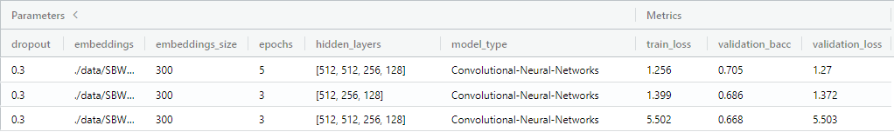

## DiploDatos-AprendizajeProfundo
Materia optativa "Aprendizaje Profundo" (Deep Learning) de la Diplomatura en Ciencias de Datos de la UNC

## Integrantes

* Ará Berberian
* Jorge Pérez
* Enzo Valverdi

# Informe

En primera instancia, comenzamos realizando pruebas con dos tipos de redes neuronales distintas, MLP y CNN en notebooks para poder entender en mayor detalle su funcionamiento. Luego de realizar dichas pruebas, desarrollamos un script llamado classifier_neural_network.py para poder correr ambos modelos de forma parametrizable incluyendo los hiperparametros.

## Resultados experimentos modelo MLP

El modelo utilizado, se configuro con las siguientes capas:

*hidden_layers = [512, 256, 256, 128]*

Cantidad de epocas para entrenamiento:

*epochs = 5*

Se probaron alterar los siguientes parametros:

* Dropuot: 0.3 y 0.7
* Batch Size: 128 y 256
* Freeze Embedings: True y False

Al poner en *False* el freeze embedings, obtenemos muchos mejores resultados que utilizando los mismos parámetros y seteandolo en *True*. Esto nos generó la duda, de que al realizar esta modificación estemos ante un caso de overfitting.

Con respecto al parametro dropout, verificamos que se obtienen mejores resultados cuando el valor es mas pequeño (0.3).

Por último, con un batch size de 256, obtenemos mejores resultados que uno de 128. Llegando a la conclusión, de que con batch size en 256 y dropout en 0.3, obtenemos el mejor resultado dejando del lado el parametro freeze embeding.

## Resultados experimentos modelo CNN

En el caso de la red neuronal CNN, se intento modificar la cantidad de capas que utiliza el modelo, se empezo por la version standar de dos capaz y se noto una mejora cuando se agregaron 2 capas, obteniendo la mejor version al realizar la siguiente combinacion:

*hidden_layers = [512, 512, 256, 128]*

Por otro lado, se intento mejorar la performance del modelo al aumentar las epocas de entrenamiento, alternando entre 3, 5 y 10 (Nos vemos restringidos por el tiempo de ejecución).

Por ultimo, se intento jugar con los parametros:

* Filter Count
* Filter Lenght

En este caso, se comenzo con la version inicial, donde el *filter count* en 100 y *filter lenght* en [2, 3, 4], pero en este caso los resultados no fueron buenos. Luego de intentar algunas opciones, llegamos a encontrar una que brindaba un resultado aceptable con los siguientes valores:

*Filter Count: 200*

*Filter Lenght: [4, 6, 7]*

Para finalizar, despues de realizar experimentos y no lograr buenos resultados, nos dimos cuenta que habiamos implementado de forma incorrecta el modelo de CNN, ya que incluiamos la funcion Sigmoide, lo que nos llevo a creer que podia ser la causa de la baja performance. Al modificar dicho "error", logramos la mejora de los resultados que se pueden observar en la imagen.

